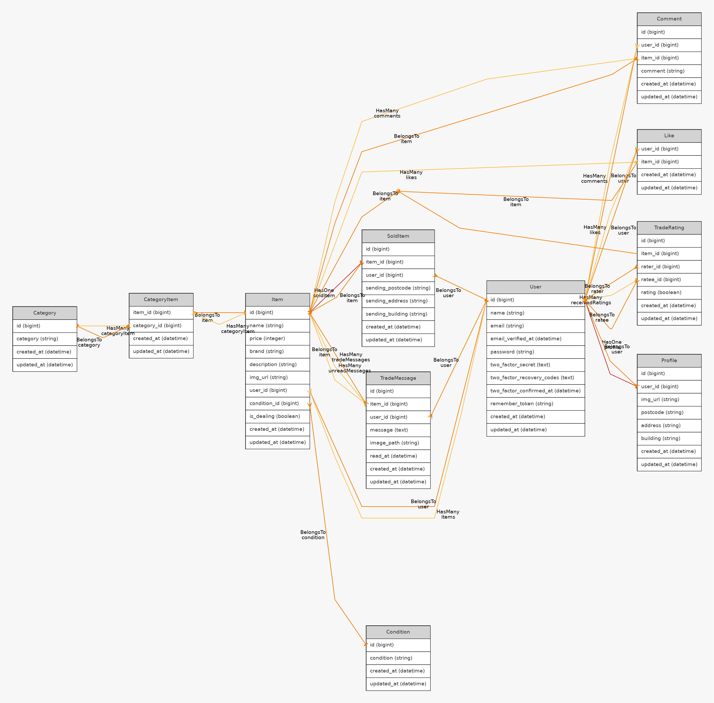

# coachtech フリマアプリ
## 環境構築
#### Dockerビルド
1. ```php
    git clone git@github.com:ume32/pro-test.git
   ```
2.docker-compose up -d --build
#### ※ MySQLは、OSによって起動しない場合があるのでそれぞれのPCに合わせてdocker-compose.ymlファイルを編集してください。
#### Laravel環境構築
1.docker-compose exec php bash

2.composer install

3.env.exampleファイルから.envを作成し、環境変数を変更

4.php artisan key:generate

5.php artisan migrate

6.php artisan db:seed


## メール認証
mailtrapというツールを使用しています。<br>
以下のリンクから会員登録をしてください。　<br>
https://mailtrap.io/

メールボックスのIntegrationsから 「laravel 7.x and 8.x」を選択し、　<br>
.envファイルのMAIL_MAILERからMAIL_ENCRYPTIONまでの項目をコピー＆ペーストしてください。　<br>
MAIL_FROM_ADDRESSは任意のメールアドレスを入力してください。　

## Stripeについて
コンビニ支払いとカード支払いのオプションがありますが、決済画面にてコンビニ支払いを選択しますと、レシートを印刷する画面に遷移します。そのため、カード支払いを成功させた場合に意図する画面遷移が行える想定です。<br>

また、StripeのAPIキーは以下のように設定をお願いいたします。
STRIPE_PUBLIC_KEY="パブリックキー"
STRIPE_SECRET_KEY="シークレットキー"

以下のリンクは公式ドキュメントです。<br>
https://docs.stripe.com/payments/checkout?locale=ja-JP

## テーブル仕様
### usersテーブル
| カラム名 | 型 | primary key | unique key | not null | foreign key |
| --- | --- | --- | --- | --- | --- |
| id | bigint | ◯ |  | ◯ |  |
| name | varchar(255) |  |  | ◯ |  |
| email | varchar(255) |  | ◯ | ◯ |  |
| email_verified_at | timestamp |  |  |  |  |
| password | varchar(255) |  |  | ◯ |  |
| remember_token | varchar(100) |  |  |  |  |
| created_at | timestamp |  |  |  |  |
| updated_at | timestamp |  |  |  |  |

### profilesテーブル
| カラム名 | 型 | primary key | unique key | not null | foreign key |
| --- | --- | --- | --- | --- | --- |
| id | bigint | ◯ |  | ◯ |  |
| user_id | bigint |  |  | ◯ | users(id) |
| img_url | varchar(255) |  |  |  |  |
| postcode | varchar(255) |  |  | ◯ |  |
| address | varchar(255) |  |  | ◯ |  |
| building | varchar(255) |  |  |  |  |
| created_at | timestamp |  |  |  |  |
| updated_at | timestamp |  |  |  |  |

### itemsテーブル
| カラム名          | 型            | primary key | unique key | not null | foreign key    |
| ------------- | ------------ | ----------- | ---------- | -------- | -------------- |
| id            | bigint       | ◯           |            | ◯        |                |
| user\_id      | bigint       |             |            | ◯        | users(id)      |
| condition\_id | bigint       |             |            | ◯        | conditions(id) |
| name          | varchar(255) |             |            | ◯        |                |
| price         | int          |             |            | ◯        |                |
| brand         | varchar(255) |             |            |          |                |
| description   | varchar(255) |             |            | ◯        |                |
| img\_url      | varchar(255) |             |            | ◯        |                |
| is\_dealing   | boolean      |             |            |          |                |
| created\_at   | timestamp    |             |            |          |                |
| updated\_at   | timestamp    |             |            |          |                |

### commentsテーブル
| カラム名 | 型 | primary key | unique key | not null | foreign key |
| --- | --- | --- | --- | --- | --- |
| id | bigint | ◯ |  | ◯ |  |
| user_id | bigint |  |  | ◯ | users(id) |
| item_id | bigint |  |  | ◯ | items(id) |
| comment | varchar(255) |  |  | ◯ |  |
| created_at | timestamp |  |  |  |  |
| updated_at | timestamp |  |  |  |  |

### likesテーブル
| カラム名 | 型 | primary key | unique key | not null | foreign key |
| --- | --- | --- | --- | --- | --- |
| user_id | bigint |  | ◯(item_idとの組み合わせ) | ◯ | users(id) |
| item_id | bigint |  | ◯(user_idとの組み合わせ) | ◯ | items(id) |
| created_at | timestamp |  |  |  |  |
| updated_at | timestamp |  |  |  |  |

### sold_itemsテーブル
| カラム名 | 型 | primary key | unique key | not null | foreign key |
| --- | --- | --- | --- | --- | --- |
| user_id | bigint |  |  | ◯ | users(id) |
| item_id | bigint |  |  | ◯ | items(id) |
| sending_postcode | varchar(255) |  |  | ◯ |  |
| sending_address | varchar(255) |  |  | ◯ |  |
| sending_building | varchar(255) |  |  |  |  |
| created_at | created_at |  |  |  |  |
| updated_at | updated_at |  |  |  |  |

### category_itemsテーブル
| カラム名 | 型 | primary key | unique key | not null | foreign key |
| --- | --- | --- | --- | --- | --- |
| item_id | bigint |  | ◯(category_idとの組み合わせ) | ◯ | items(id) |
| category_id | bigint |  | ◯(item_idとの組み合わせ) | ◯ | categories(id) |
| created_at | timestamp |  |  |  |  |
| updated_at | timestamp |  |  |  |  |

### categoriesテーブル
| カラム名 | 型 | primary key | unique key | not null | foreign key |
| --- | --- | --- | --- | --- | --- |
| id | bigint | ◯ |  | ◯ |  |
| category | varchar(255) |  |  | ◯ |  |
| created_at | timestamp |  |  |  |  |
| updated_at | timestamp |  |  |  |  |

### conditionsテーブル
| カラム名 | 型 | primary key | unique key | not null | foreign key |
| --- | --- | --- | --- | --- | --- |
| id | bigint | ◯ |  | ◯ |  |
| condition | varchar(255) |  |  | ◯ |  |
| created_at | timestamp |  |  |  |  |
| updated_at | timestamp |  |  |  |  |

### trade_messagesテーブル
| カラム名        | 型            | primary key | unique key | not null | foreign key |
| ----------- | ------------ | ----------- | ---------- | -------- | ----------- |
| id          | bigint       | ◯           |            | ◯        |             |
| item\_id    | bigint       |             |            | ◯        | items(id)   |
| user\_id    | bigint       |             |            | ◯        | users(id)   |
| message     | text         |             |            |          |             |
| image\_path | varchar(255) |             |            |          |             |
| read\_at    | timestamp    |             |            |          |             |
| created\_at | timestamp    |             |            |          |             |
| updated\_at | timestamp    |             |            |          |             |

### trade_ratingsテーブル
| カラム名        | 型         | primary key | unique key | not null | foreign key |
| ----------- | --------- | ----------- | ---------- | -------- | ----------- |
| id          | bigint    | ◯           |            | ◯        |             |
| item\_id    | bigint    |             |            | ◯        | items(id)   |
| rater\_id   | bigint    |             |            | ◯        | users(id)   |
| ratee\_id   | bigint    |             |            | ◯        | users(id)   |
| rating      | tinyint   |             |            | ◯        |             |
| created\_at | timestamp |             |            |          |             |
| updated\_at | timestamp |             |            |          |             |


##ER図



## テストアカウント
name: ユーザー1  
email: user1@gmail.com  
password: password  
-------------------------
name: ユーザー2  
email: user2@gmail.com  
password: password  
-------------------------
name: ユーザ−3  
email: user3@gmail.com  
password: password  
-------------------------

## PHPUnitを利用したテストに関して
以下のコマンド:  
```
//テスト用データベースの作成
docker-compose exec mysql bash
mysql -u root -p
//パスワードはrootと入力
create database test_database;

docker-compose exec php bash
php artisan migrate:fresh --env=testing
./vendor/bin/phpunit
```
※.env.testingにもStripeのAPIキーを設定してください。  
## 権限設定

### データベースユーザー権限
本アプリケーションでは、`laravel_user` ユーザーがデータベースにアクセスするための権限を持っています。このユーザーに対する権限付与は、以下のコマンドを実行して設定します。

```sql
GRANT ALL PRIVILEGES ON test_database.* TO 'laravel_user'@'%';
FLUSH PRIVILEGES;
```

## 使用技術

* PHP 7.4.9
* Laravel 9.0
* MySQL 8.0
* Nginx 1.21
* phpMyAdmin 
* Docker
* Stripe API
* Mailhog
* Mailtrap
* PHPUnit
